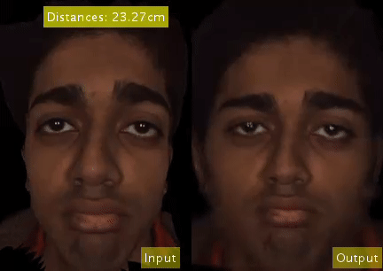

# Learning-Perspective-Undistortion-of-Portraits

## Introduction

Near-range portrait photographs often contain perspective
distortion artifacts that bias human perception and
challenge both facial recognition and reconstruction techniques.
We present the first deep learning based approach
to remove such artifacts from unconstrained portraits. In
contrast to the previous state-of-the-art approach [23], our
method handles even portraits with extreme perspective distortion,
as we avoid the inaccurate and error-prone step of
first fitting a 3D face model. Instead, we predict a distortion
correction flow map that encodes a per-pixel displacement
that removes distortion artifacts when applied to the
input image. Our method also automatically infers missing
facial features, i.e. occluded ears caused by strong perspective
distortion, with coherent details. We demonstrate that
our approach significantly outperforms the previous stateof-
the-art [23] both qualitatively and quantitatively, particularly
for portraits with extreme perspective distortion or
facial expressions. We further show that our technique benefits
a number of fundamental tasks, significantly improving
the accuracy of both face recognition and 3D reconstruction
and enables a novel camera calibration technique from
a single portrait. Moreover, we also build the first perspective
portrait database with a large diversity in identities, expression
and poses, which will benefit the related research
in this area.
## Dataset


## Beam-splitter system

## Applications

### 1. Portrait Undistortion (Demos are coming soon...)
  
### 2. Run-time Head mounted camera undistortion 
   

### 3. Camera Parameter Estimation (Demos are coming soon...)

### 4. Face Verification

### 5. Landmark Detection Enhancement

### 6. Robust 3D Face Reconstruction from images

### Citation

If you find our project useful in your research, please consider citing:

[Paper](#introduction)  [Data]  [Code](coming soon)

```
@article{
}
```

