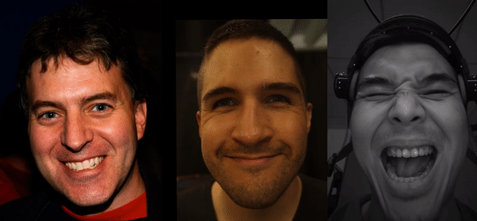
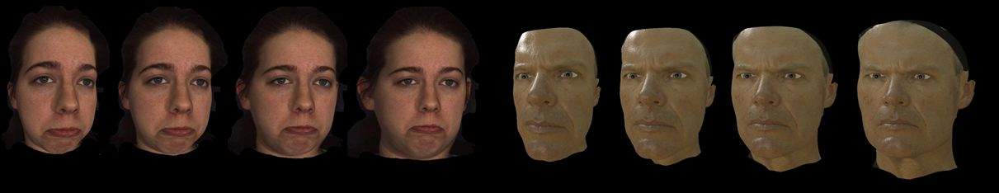
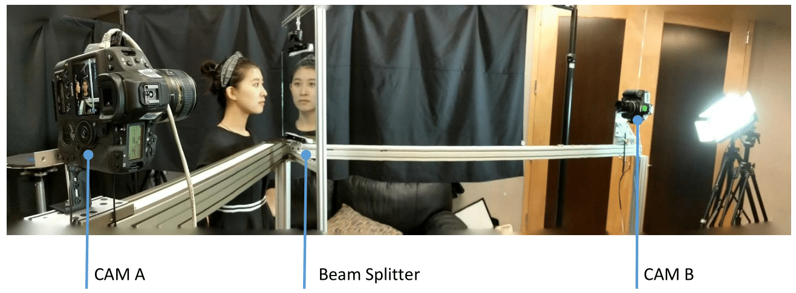
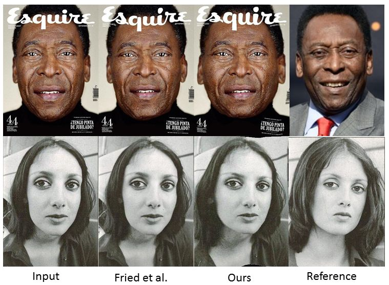
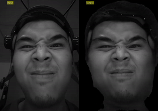

# Learning-Perspective-Undistortion-of-Portraits

## Introduction

Near-range portrait photographs often contain perspective
distortion artifacts that bias human perception and
challenge both facial recognition and reconstruction techniques. In this project we predict a distortion
correction flow map that encodes a per-pixel displacement
that removes distortion artifacts when applied to the
input image. Our method also automatically infers missing
facial features, i.e. occluded ears caused by strong perspective
distortion, with coherent details. Our technique benefits
a number of fundamental tasks, significantly improving
the accuracy of both face recognition and 3D reconstruction
and enables a novel camera calibration technique from
a single portrait. Moreover, we also build the first perspective
portrait database with a large diversity in identities, expression
and poses.

## Dataset
Our training dataset contains 278 different individuals rendered with randomly sampled focal length, camera views and lighting environment. 


## Beam-splitter system
To demonstrate that our system scales well to real-world portraits, we also devised a twocamera beam splitter capture system that would enable simultaneous photography of a subject at two different distances. With carefully geometry and color calibration, the two hardware-synced cameras were able to capture nearly ground truth portraits pairs of
real subjects both with and without perspective distortions.


## Applications

### 1. Portrait Undistortion (Demos are coming soon...)
  
### 2. Run-time Head mounted camera undistortion 
   

### 3. Camera Parameter Estimation (Demos are coming soon...)


### 4. Robust Image-based 3D Head Reconstruction


### 5. Landmark Detection and Face Verification Enhancement

[Paper](#introduction)  [Data]  [Code](coming soon)

### Citation

If you find our project useful in your research, please consider citing:


```
@article{Zhao2019learning,
  title={Learning Perspective Undistortion of Portraits},
  author={Zhao, Yajie and Huang, Zeng and Li, Tianye and Chen, Weikai and LeGendre, Chloe and Ren, Xinglei and Xing, Jun and
  Shapiro, Ari and Li, Hao},
  journal={arXiv preprint arXiv:1905.07515},
  year={2019}
}
```

